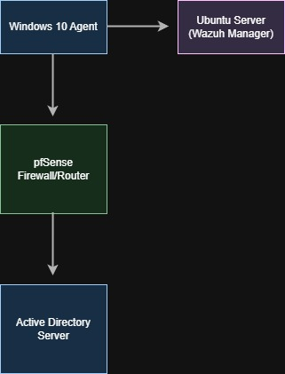
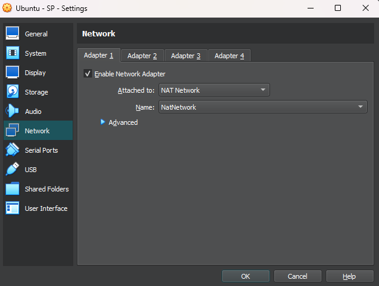
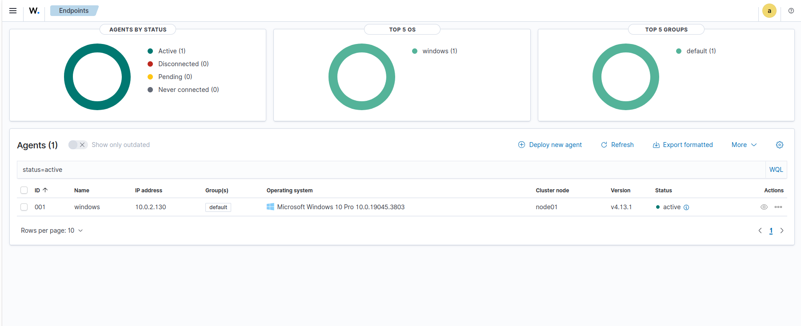
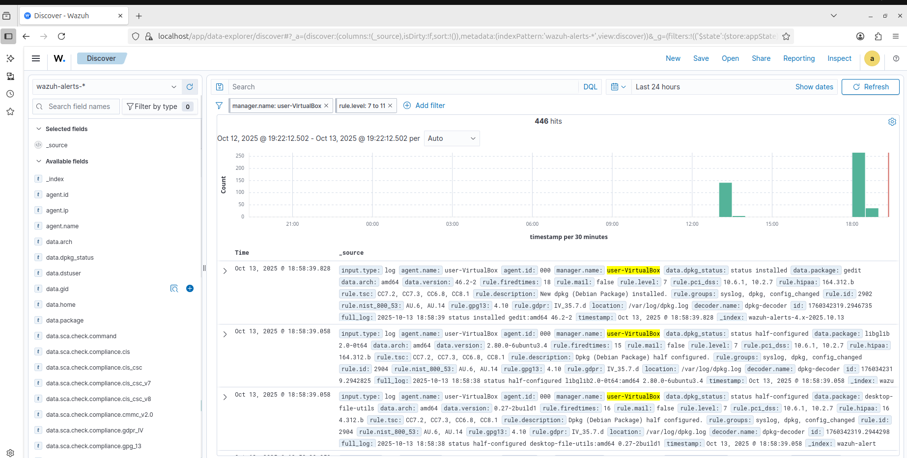
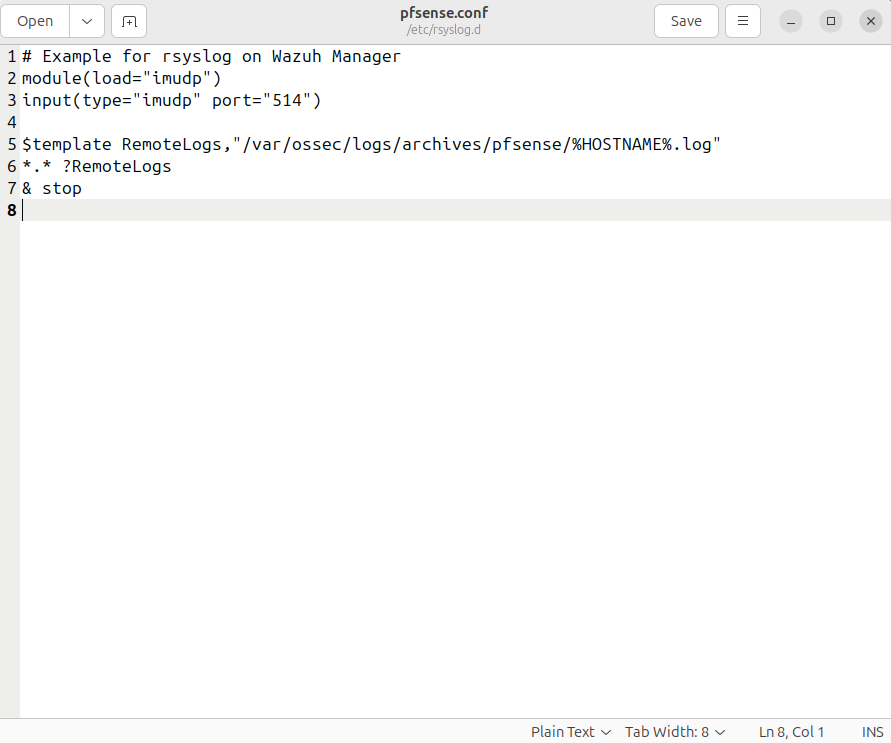
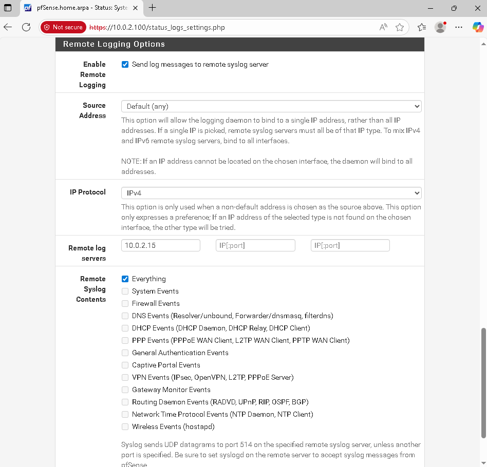

# wazuh-siem-lab
## 1. Project Overview

This is my implementation of the Wazuh SIEM, installed on a Windows 10 virtual machine, with pfSense and Active Directory configured. The main objective of this lab is to gain a working understanding of the installation, configuration, and maintenance of a SIEM in an industry-like environment. My setup involves a Windows 10 agent machine and an Ubuntu server which hosts the Wazuh manager (both as VirtualBox VMs).

---

## 2. Network Topology

---

## 3. Environment & Tools

- **VirtualBox:** 7.0.12  
- **Windows 10:** Version 22H2 (OS Build 19045.3803)  
- **Ubuntu:** 24.04 LTS
- **Wazuh:** 4.13.1
---

## 4. Setup Steps

1. Install Ubuntu 24.04 (to act as the manager).
2. Configure Ubuntu's network to be on the same virtual network as the Windows 10 machine.
	
3. Download and install the Wazuh Manager: 
	- `curl -sO https://packages.wazuh.com/4.13/wazuh-install.sh && sudo bash ./wazuh-install.sh -a`
4. Access the Wazuh Dashboard through localhost and log in with the credentials provided after installation.
5. In the dashboard, navigate to the agents section and configure a new agent: 
	- Either run the provided command on the Windows 10 machine, OR 
	- Download the Windows agent installer on another machine and transfer it to the Windows 10 VM for installation.
6. Once the agent is installed, it should appear in the Wazuh dashboard.
	
7. Logs should now be visible under the Discover tab.
	
---

## 5. Lessons Learned

### Challenges & Solutions

- **Installing the Wazuh manager:** Initial installations failed repeatedly. Reinstalling Ubuntu 24.04 LTS and ensuring full system updates resolved dependency issues.
- **LAN Configuration:** The Windows 10 agent couldn't reach the internet, providing direct installation from Wazuh's repository. The workaround was to download the installer on another host, transfer it to the agent VM, and install it locally.
- **pfSense syslog configuration:** Attempted to forward pfSense and Suricata logs to Wazuh via remote syslog. Steps included:
	- Creating a pfSense configuration to forward logs to the SIEM:
		
  	- Enable remote logging.
		
	However, logs didn't appear in Wazuh. This was likely due to misconfigured ports or firewall rules. Time constraints prevented further debugging.
---
### Future Improvements

- **Integrate pfSense and Suricata Logs:** Properly configure pfSense syslog and Suricata IDS output to forward to Wazuh.
- **Add Elastic Stack Visualisation:** Expand beyond Wazuh's default dashboard by building custom Elasticsearch visualisations and alert dashboards.
- **Test and modify Wazuh rules:** Add Windows security events with AD logs.
